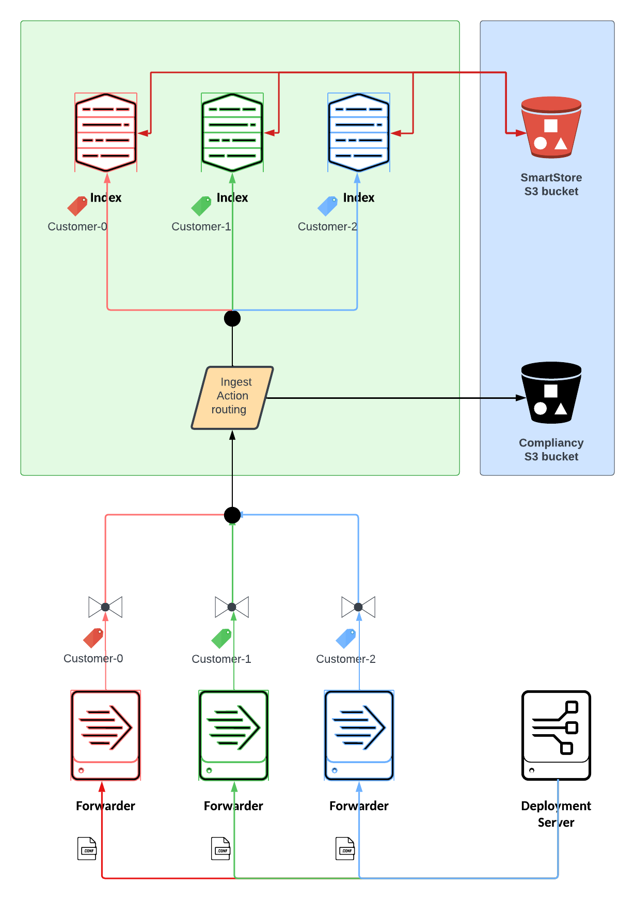

# Datalake

Proof of concept architecture to segregate traffic from various customers.

Each customer is tagged. Based on the tagging both the throughput and the destination are adjusted.

The troughput and the tagging is set per Unversal Forwarder class.

The traffic is segregated using ingest actions.

All customer indexes are using Smartstore to lower storage footprint.

## Architecture

